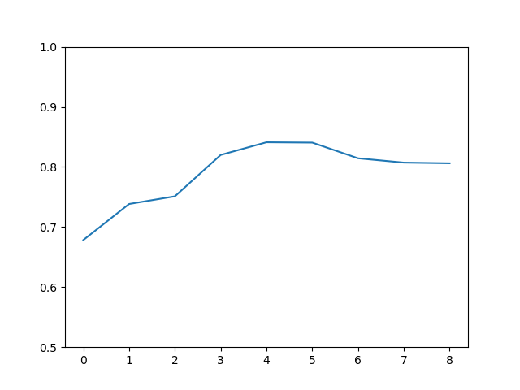

<center><h1>NLP Project1-文本情感分类</h1>
<p1>201300096 杜兴豪 人工智能学院</p1>
</center>
[TOC]

### 数据预处理
我们拿到的数据集，是由繁体中文组成的酒店、当当网等的评论文字。为了将其转化成机器可以识别的内容，需要对数据进行预处理工作。我采用的预处理流程如下：
1. 繁体字转化为简体
2. 分词
3. 去除停用词
4. 对剩余词进行编码
5. 获得每一句评论的句向量（即模型输入）

在我的实现中，这一部分在utils.py文件中完成。前3个部分较为简单，实现过程大多为调取包进行操作，因此简要描述：
* read_txt()方法：读入文本文档并将繁体转化为简体，用到了opencc包
* partition_word()方法：将转化好的句子作为输入，利用jieba分词包来进行句内分词
* delete_stopwords()方法：传入分词结果（一个词表），将停用词从其中除去。停用词表下载自[中文停用词表](https://github.com/goto456/stopwords/blob/master/cn_stopwords.txt)

上述三种方法被集成于load_words()方法中，只需调用该方法，即可通过.txt文件直接获取最终结果。需要注意的是，在去除停用词时，我将'？'和'！'从停用词表删去了，具体原因见后。
### 构建句子编码
目前比较常见的有三种构建方法：
* 构建词向量，对每个句子中的所有词向量进行处理后，得到句向量
* 统计句子中出现的词语，按照词频构建句子的词袋模型
* 通过词频-逆文档频率统计句子中词语的重要性，并以此构建句向量。

#### 利用word2vec方法构建词向量
利用预训练过的model来对句子中的每个词进行向量化，再对所有词进行加权求和来获得最终的句子向量。由于文本来源比较多样，词频信息分布并不十分集中，导致很多句子中词语的权重计算起来十分困难，因此我在这里采用直接求和取平均的方式来构建句向量。利用数学语言描述为：令句子表述为$S=\{w1,w2,\dots,w_n\}$，其中$w_i$为词，则其编码为
$$
encode(S)=\frac1n\sum^n_{i=1}encode(w_i)
$$
而$w_i$是通过word2vec库中预训练的模型计算得出的，具有一定的泛化能力，可以认为是合理的词向量。据此建模，得到输入句子的数学建模。

#### 利用CountVectorizer方法构建词袋模型
词袋模型的构建存在已有的包，因此我们不需要重复造轮子，只需要
```python
from sklearn.feature_extraction.text import CountVectorizer
```
来获得这个方法即可。注意到删去停用词后仍然有20000余词，因此不能直接构建词袋模型，否则输入矩阵的大小将达到$5000\times 20000=10^8$数量，使得存储开销和运算开销都巨大的同时，还不便于模型学出正确的特征，因此需要选择其中的一部分。

观察文本，有些词如“我”，“我们”，几乎存在于所有的句子中，但对判断情感的作用不大，因此这些出现频率特别高的词应该去掉；再比如像“拍案叫绝”“操作系统”这些在评论中出现特别少的词，虽然可能为这个句子的情感判别带来一些帮助，但模型如果采取这些过于特别的特征，反而会降低其泛化能力，造成正确率下降，因此像这样的特征也应该筛除。

在选择出现占比不低于3篇评论，也不高于所有评论文章的70%后，从两万余属性中筛选除了3956个属性，作为最终的词袋模型特征。

#### 利用TfidfVectorizer方法构建词频-逆文本频率模型
这个方法的用法和CountVectorizer方法大致相同。实际应用中由于词袋模型太过于稀疏，导致效果实在不能令人满意，因此采用该方法较多。

### 分类器
#### 已经有的轮子
sklearn库为我们提供了多种多样的分类器，值得一试：

#### 库中没有但对文本分类很有效的分类器
查阅资料发现针对文本分类问题，LSTM可以达到很好的分类效果，因此我在LSTM.py中实现了自己定义的模型、训练和预测函数，为了保持代码的一致性，我为它设计了和sklearn中相同的接口（fit(), predict()），在main.py中可以看到它们的集成。

不过由于效果不佳（78%）左右，并且重复训练时间很大，在后文中不提及这个模型了。
#### 分类器的选取
> 当然是选择分类效果最好的！

由于测试集上的准确率获取成本太高（手动在OJ上提交），因此采用划分原训练集为新训练集和验证集的方法，仅在新训练集上训练，在验证集上测试学习性能。得到的图像如下：

从左往右依次为：梯度增强决策树分类器；AdaBoost分类器；决策树分类器；MLP分类器（原参数）；MLP分类器（自定参数）；支持向量机分类器；随机森林分类器；朴素贝叶斯分类器；logisitic分类器。

观察到自定义的多层感知机分类器效果最好，因此将采用MLP进行深层次的优化。

通过最优的分类器，尝试选择最优的建模方法：

从左往右依次为：word2vec，CountVectorizer，TfidfVectorizer方法。

由于word2vec无法和剩余两个方法获得相同的维度数，因此采用合理范围内的较优维度参评（500 vs 10000）

观察到TfidfVectorizer方法的效果最优，因此选择此方法。


### 性能提升
我采用了以下的方法来提升我的分类器性能：
* 扩大语料库
* 精细化筛选语料
* 调参

扩大语料库这一条提升性能十分明显。为了防止过拟合，我找来了4000条[酒店评论](https://github.com/linguishi/chinese_sentiment/tree/master/data/hotel_comment/raw_data)加入到训练集中，使性能提升了飞跃（大约是从0.77跨越到0.82）

此外，观察到停用词对中文的感叹号和问号也进行了筛除。针对普通文本分类时，标点可能没有意义，但针对情感分类时，这些标点的作用是十分显著的：“酒店 卫生 认真 ？”针对这样一条语料，如果符号是问号，可能表达的意思是酒店卫生差劲，但如果是感叹号，则表达赞赏的可能性就显著提高了。因此问号和感叹号这样表情感的标点不能被筛掉。 

最后，就是魔法的加入了（），经过我不断的尝试和调整Vectorizer和MLP的参数，终于通过设置如下参数：
* 最大文本出现max_df=0.9，即出现在少于90%的语料中的特征
* 最小文本出现min_df=3，即出现在多于3条语料中的特征
* 多层感知机的最大迭代轮数：120防止过少拟合不完全和过多导致过拟合

调参让我的模型从82%的准确率一点一点地挪动到了88.7%

### 遇到的问题
起初，在还没有弄明白各种Vectorizer的用法的时候，我采用了这样的方法：
* 对训练集和目标分别调用Vectorizer对其向量化
* 利用向量化的训练集进行模型训练
* 用训练好的模型预测目标的标签

结果发现，准确率永远停留在50%上下，效果甚至不如return 0（52.1%）静下心来读了sklearn中提供的手册和一些前人的经验后，我才明白了Vectorizer的原理，也明白为什么我的训练结果不靠谱：分别向量化导致词频信息完全不同，出现在矩阵相同位置的元素代表的可能是完全不同的两个词，这样训练出的结果明显不具有学习的意义，因此模型预测结果近似于随机胡猜。

在明白原理后，我把训练集和测试集的文本信息进行整合，再一起投入Vectorizer进行向量化，选出其中有标签的部分进行模型训练，再对无标签的部分进行预测。结果一下就提升到了70%以上，证明我的思路是合理的。

### 实验总结
$\qquad$这次实验让我了解了如何利用机器学习模型来做文本的情感分类，也在实现细节中了解了一些把自然语言转化成机器语言的方法，不停更换模型和调整参数的过程中也让我对前人实现的库函数有了更深的了解和掌握，在之后的学习中可以将它们更好的应用于自己的代码，让自己的实现更加简洁有效，这次实验带给我的意义十分重大。


### 运行方法
[README.md](README.md)
* 实验结果：找到文件夹中的main.py并运行之，将在同文件夹下得到201300096.txt文件。
* 报告中的分类器和建模方法的对比图：运行choose_clf.py文件
#### 环境依赖
> 基础依赖：Python3 + scikit-learn
* 若想尝试我自己实现的LSTM，则需要torch包（CUDA非必须）
* 若想要复现报告中的几幅图，需要matplotlib包
